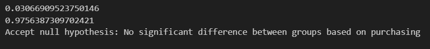
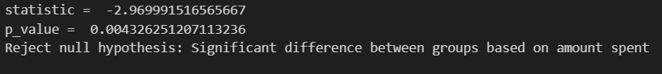

# A-and-B-testing

This project uses data from two different marketing campaigns to find a better approach to finding customers, marketing products, getting a higher reach, or anything that helps a business convert most of its target customers into actual paying and buying customers.
From analysis it is observed that there is not much difference between the two campaigns based on conversion of clicking customers to paying customers.  

However, there is a huge difference based on actual expenditure for each of the campaigns. 

